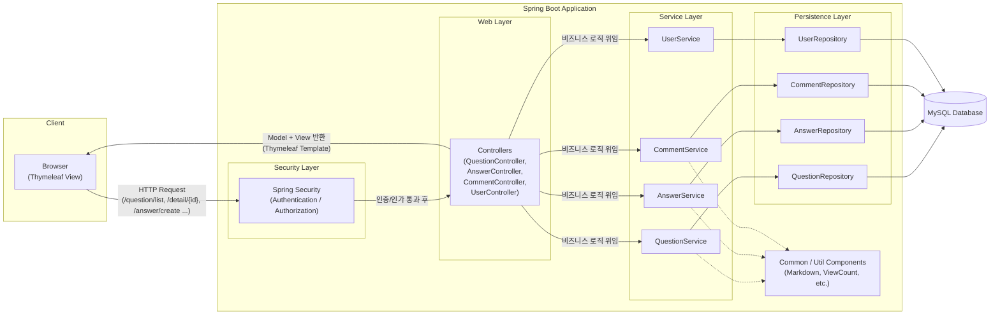
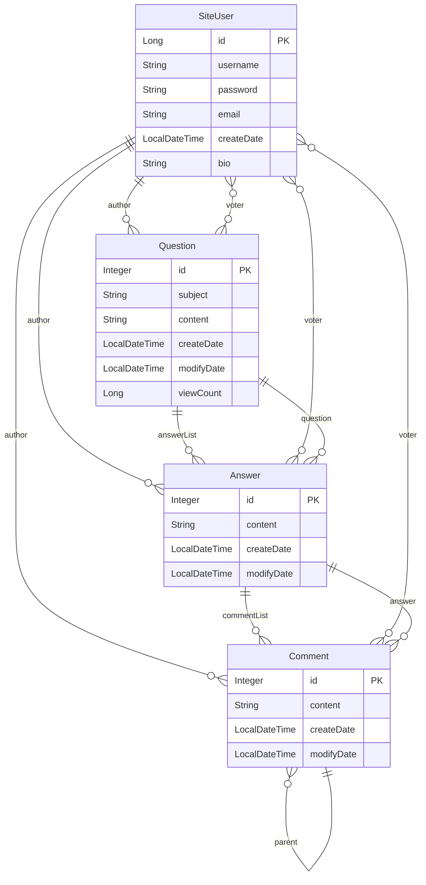

# 우테코 8기 4주차 오픈미션
작성자 : 박지용

## 🧭 개요
이 프로젝트는 E북으로 무료 제공되는 "점프 투 스프링부트"를 기반으로 한 
게시판 구현 리팩토링 학습용 프로젝트입니다.
[점프 투 스프링부트](https://wikidocs.net/book/7601)

## 💡 미션 선택 이유
3년 전에 동일 저자의 책인 점프투파이썬 - flask 편으로 게시판 코드를 만들어본 바 있습니다.
당시에 Python, Flask + Jinja Template + SQLAlchemy 조합으로 진행해보았습니다.
[Flask 게시판](https://github.com/JYPark-Code/flask-board)

그 때와 달리, 현재는 Java/Spring에 대한 이해도가 있는 상태에서 Code Along하고,
책의 완성된 코드 구조를 개선하는 것을 목표로 진행했습니다.

## ⚙️ 개발 환경
* IDE: IntelliJ IDEA (Eclipse 미사용)
* DB: MySQL 8.0.44 (예제의 H2 Database 대체)
* Framework: Spring Boot 3.5.7
* Template Engine: Thymeleaf
* Language: Java 21
* Build Tool: Gradle
* Docker


## 🚀 프로젝트 실행 방법 - Docker 없는 버전

0. 필수 요구사항
* Java 21
* Gradle
* MySQL 8.x
* Git Client

1. MySQL 설정

* MySQL에서 데이터베이스 생성 - (자동으로 생성됩니다.)
  * schema.sql 참고 (안되는 경우 terminal>mysql에서 실행 or mysql Workbench)
```sql
CREATE DATABASE IF NOT EXISTS board_db
  DEFAULT CHARACTER SET utf8mb4
  COLLATE utf8mb4_general_ci;
```
* 환경변수 설정
* 다음 3개의 방법 중 1개 사용.
  * bash
```bash
export MYSQL_ID=your_mysql_username
export MYSQL_PASSWORD=your_mysql_password
```
  * Windows PowerShell
```PowerShell
$env:MYSQL_ID="root"
$env:MYSQL_PASSWORD="1234"
```
  * .env 파일
  프로젝트 파일(openmission) 바로 하위에 .env 파일을 만들고 하단의 내용을 적고 저장.
    * (물론 your_mysql_username과 pw는 사용자 환경에 맞게 변경)
```declarative
MYSQL_ID=your_mysql_username
MYSQL_PASSWORD=your_mysql_password
```

* application.yml
  * 첫줄로 실행 두번째 줄은 도커를 위함.

* Sample DB, 데이터 제공
두가지 방법 중 1개를 택.
  * resources/sample-data.sql을 data.sql로 바꾸고 실행.
  * 명령어로 처리
```declarative
mysql -u root -p board_db < src/main/resources/sample-data.sql
```

## :whale: Docker로 실행

0. 필수 요구 사항
* Docker 설치, Docker-Compose 설치.(Docker 설치 시 자동으로 포함되서 Install) 

1. 실행 방법

1-1. * application.yml
* 첫줄 주석, 두번째줄 url 실행.


1-2. 빌드

```declarative
./gradlew clean build
```

1-3. 도커 실행

```declarative
docker-compose build
docker-compose up
```
## :computer: 성공적으로 띄웠다면, 보이는 화면


## :black_nib: 아키텍처

## :black_nib: ERD (Entity Relationship Diagram)



## 🧩 구현 목록

Part 1 - 게시판
* Entity 설계 및 연관관계 매핑
* Repository 별 DB 관리
* 게시 글 상세 보기 (질문 목록 보기)
* Root URL 적용하기
* Controller - Repository - Service 계층 분리
* 상세 페이지 만들기 (Thymeleaf를 이용한 View Template 구성)
* URL prefix 적용하기
* 답변 만들기
* Bootstrap css 적용하기
* 표준 HTML 구조 적용하기
* 예외 처리 및 유효성 검증 (Validation)
* form 활용하기

---

Part 2 - 게시판
* Navigation 바 추가
* 페이징 처리
  * 테스트 데이터 넣기 (300개)
  * 최신순으로 Sorting하기.
* 게시물 번호 부여하기
* 답변 개수 표시하기
* Spring Security를 이용한 회원 가입 기능 개발
  * 비회원 게시판 구경 허용 (Spring Security 로그인 페이지 우선 접속 해제)
  * 회원 엔티티 구현 및 Service, Controller 구현
  * 중복 로그인 방지
  * 책의 Spring Security v6 -> v7로 코드 개선 (Deprecated된 AntPathRequestMatcher 처리) 
* 로그인/로그아웃 구현
  * Spring Security 로그인 기준 UserSecurityService 구현하기 (UserSecurityService implement UserDetailsService)
  * 유저 등급 나누기 (Enum)
  * 로그인, 로그아웃 상태 템플릿에 적용하기
* 게시판에 작성자 컬럼 추가
  * 게시글에 작성자 추가
  * 답글에 작성자 추가
* 수정/삭제 기능 추가하기
  * 질문 수정/삭제
  * 댓글 수정/삭제
  * 수정 일시 표시하기
* 추천 기능 추가하기
  * 질문 추천 기능 추가
  * 답변 추천 기능 추가
* 앵커 기능 추가하기
  * 답변 앵커 추가하기 - why? : 답변 작성, 수정시 페이지 상단으로 스크롤 이동하는 것을 답변이 있는 location에 고정.
  * 리다이렉트 수정하기
  * 답변 Service, Controller 수정하기
* 마크다운 적용하기
  * 작성에 마크다운 적용(노션, Github, velog 등)
* 검색 기능 추가하기
  * 검색 기능 구현하기 1 - JPA Specification 사용. - QuestionService에서 Predicate로 구현
  * 검색 기능 구현하기 2 - @Query 사용하기. - Repository에서 JPQL로 구현
  * 검색 화면 만들기
  
---
Part 3 - Out of Book 
#### 추가기능 개발하기
* 답변 페이징, 정렬 기능 추가 - 답변은 5개 디스플레이가 기본이고, 넘어 갈 경우 페이지가 생성된다. 
* 답변 - 댓글 기능 추가 + 대댓글 기능 추가 - 난이도 ★★★★☆
  * 비로그인시 댓글 보기
  * 로그인시 추천, 댓글, 수정, 삭제 가능
  * 부모 댓글 삭제 시, 연쇄 삭제 기능
  * 특수 케이스 처리 : CSRF 오류 -> 구글 독스 해결 방법 정리
* My Page 구현하기
  * 가입일 추가
  * 가입일 경과일 추가
  * 활동 요약 작성
  * 추천 Count
  * 최근 작성한 질문 / 답변 / 댓글
    * 링크 구현
  * 프로필 편집
    * 이메일 편집
    * 자기소개
  * 비밀번호 변경 & 임시 비밀번호 발급 
    * 로그인 후 마이페이지 새 비밀번호/새 비밀번호 확인
    * 비밀번호 찾기 - 가입 시 넣은 이메일로 본인 인증 -> 임시 비밀번호 8자리 발급
* 최근 답변 / 추천 답변 순으로 노출하기
* 조회 수 표시하기
  * 메인 페이지 Column 추가.
  * 상세 페이지 내 추가.
  * Transaction 적용

Part 4 - Docker
* Docker에 맞게 application.yml 재작성
* Dockerfile 작성
* Docker-compose 작성
* Docker 실행 확인 -> 컨테이너화 후 작동 확인.

Part 5 - QC, debug, 기능 개선 (+extra)
* 도커용, local용 DB 링크 url 추가
* My page - 추천한 질문 - 작성한 질문과 같이 올라가는 것 수정
* 추천한 게시물 추천 취소 시 추천 안하시겠습니까? Alert 추가
* 질문, 답글에 추천, 추천취소 토글 적용 (이전 버전 추천 취소가 안됬음)
* 질문, 답글, 댓글 - 추천 눌렀을 때 Redirect 수정 
  * 댓글이 열린 상태에서 추천 눌렀을 때, 닫긴 URL로 리다이렉트 하는 것
    * 오픈 상태값 추적해서 상태 유지.


## :camera: 스크린샷
1. 게시판 목록 (로그인 전, 로그인 후)
   
   

2. 로그인 창, 비밀번호 찾기
   
   
   

3. 마이페이지
   

4. 게시판 상세페이지
   
   

5. 검색 결과
   

6. 질문 등록
   
